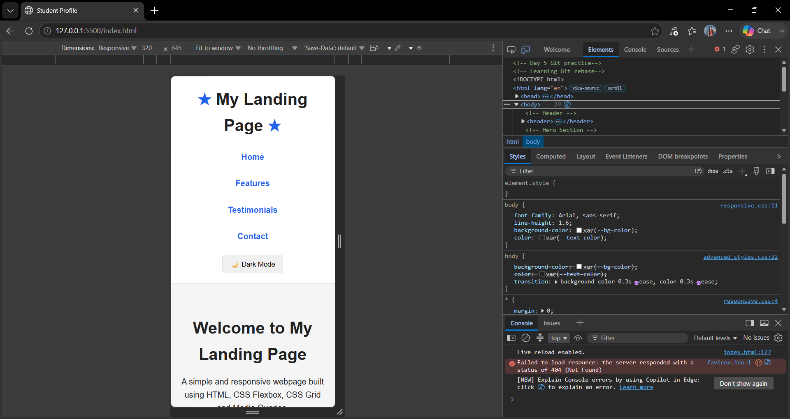
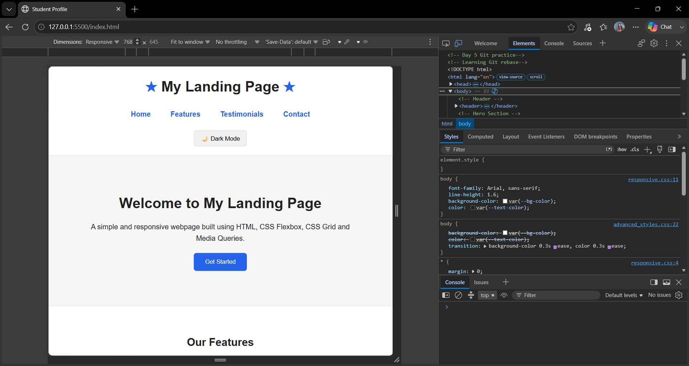
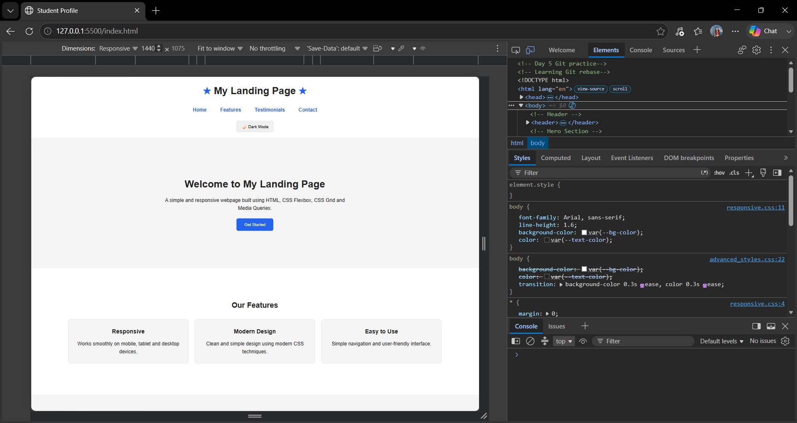

# Responsive Landing Page

## Week 2 - Day 2: Responsive Design

This project is a fully responsive landing page created using HTML and CSS.

### Sections

- Hero Section
- Features Section
- Testimonials Section
- Footer

### Technologies Used
P
- HTML5
- CSS3
- CSS Flexbox
- CSS Grid
- Media Queries
- CSS Custom Properties

### Responsive Breakpoints

- 320px - Mobile
- 768px - Tablet
- 1024px - Desktop
- 1440px - Large Desktop

### Responsive Testing

The webpage was tested using Chrome DevTools at different screen sizes.

### Screenshots

#### Mobile - 320px

#### Tablet - 768px

#### Desktop - 1440px

## Conclusion

The landing page adapts to mobile, tablet and desktop screen sizes using CSS Grid, Flexbox and media queries.