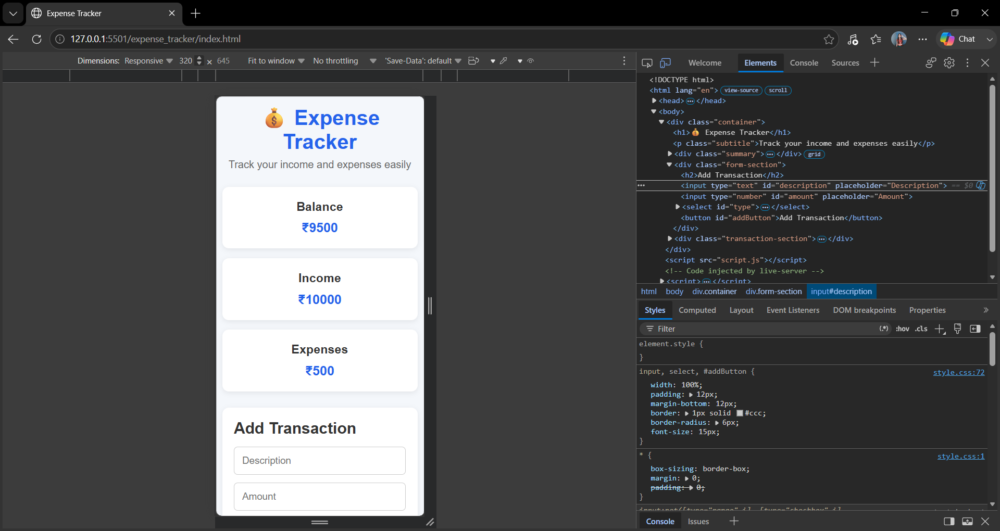
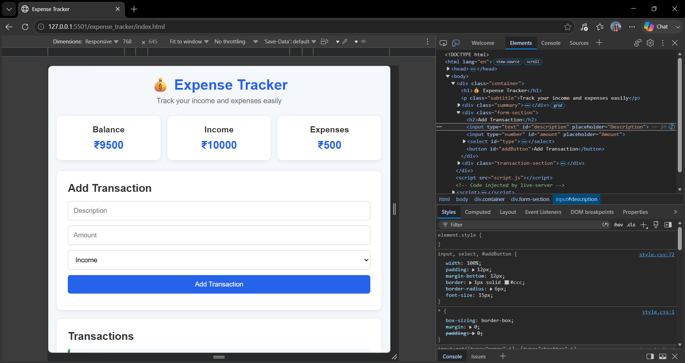
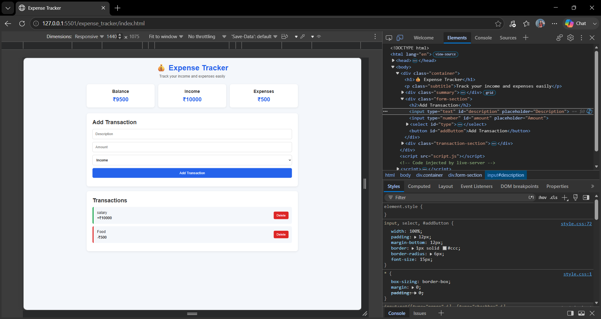

# Expense Tracker

## Week 2 - Day 5: Frontend Mini Project

A simple and responsive Expense Tracker web application built using HTML, CSS and JavaScript.

The application allows users to add income and expenses, view their balance, and delete transactions. Transaction data is saved using localStorage, so it remains available after refreshing the page.

## Features

- Add income transactions
- Add expense transactions
- Calculate total income
- Calculate total expenses
- Calculate current balance
- Delete transactions
- Save transactions using localStorage
- Responsive design for mobile, tablet and desktop
- Simple and user-friendly interface

## Technologies Used

- HTML5
- CSS3
- JavaScript ES6+
- DOM Manipulation
- localStorage
- CSS Media Queries
- Git and GitHub

## Responsive Design

The application was tested on different screen sizes:

- 320px - Mobile
- 768px - Tablet
- 1440px - Desktop

## Screenshots

### Mobile



### Tablet



### Desktop



## Live Demo

GitHub Pages link will be added after deployment.

## Project Structure

```text
expense_tracker/
├── index.html
├── style.css
├── script.js
├── README.md
├── mobile.png
├── tablet.png
└── desktop.png